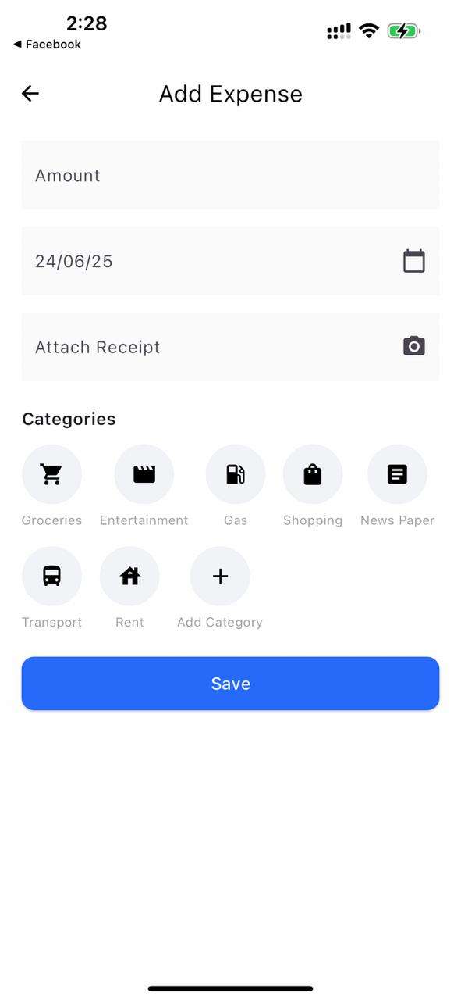

# 💸 Expense Tracker Lite

A lightweight mobile expense tracking app with offline storage, currency conversion, pagination, and modern UI — built using **Flutter**, **Bloc**, **Hive**, and **Clean Architecture**.

---

## 🔧 Architecture & Project Structure

This app follows **Clean Architecture**:
- `lib/core/`: Shared utilities (e.g. `enums`, `error`, `constants`)
- `lib/data/`: Hive models, datasources, repository implementations
- `lib/domain/`: Entities, use cases, repository contract
- `lib/presentation/`: UI screens and BLoC logic

---

## 🧠 State Management

Using **flutter_bloc**:
- Each feature has its own Bloc (e.g. `DashboardBloc`, `AddExpenseBloc`)
- BlocBuilder and BlocListener for UI reactions

---

## 🌍 API Integration

Using `dio` to fetch live exchange rates from:
- `https://open.er-api.com/v6/latest/USD` (no API key required)

On expense submission:
- Convert the amount to USD before saving using the API
- Save both original and converted amounts locally

---

## 📄 Pagination Strategy

Pagination is **handled locally**:
- Loads 10 expenses per page from Hive
- Supports infinite scroll via `ScrollController`
- Supports filtering ("This Month", "Last 7 Days")

---

## 📸 Screenshots

### 🏠 Dashboard Screen


### ➕ Add Expense Screen


## 🧪 Testing

- ✅ Currency calculation
- ✅ Expense validation
- ✅ Include one unit test or widget/UI test
- ✅ Pagination logic

Run tests with:

```bash
flutter test